typora-root-url: wdsrimage

# WDSR论文笔记

## 1 图像超分简介以及评价指标

超分辨率(super-resolution)的通俗解释就是：将低分辨率的图像通过算法转换成高分辨率图像。普通的放大会丢失图像信息，超分不会。

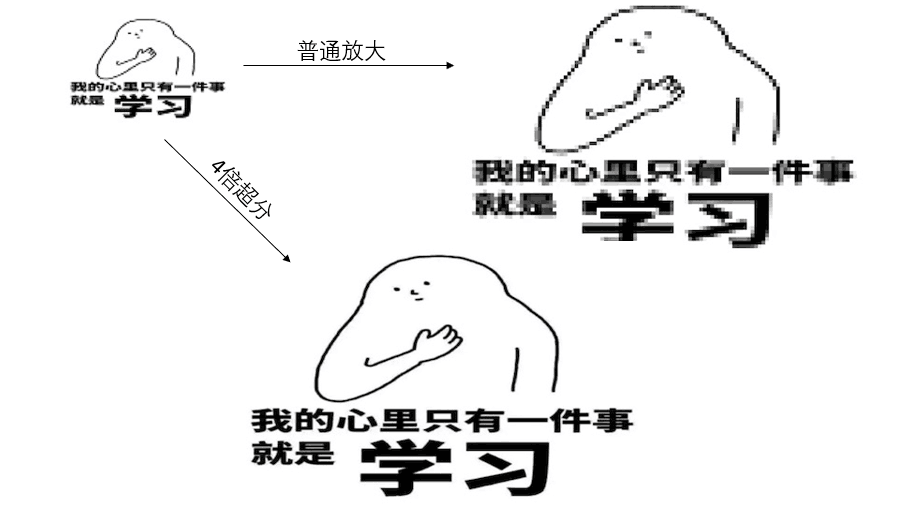

### 1.1 PSNR-峰值信噪比

​	是一个表示信号最大可能功率和影响它的表示精度的破坏性噪声功率的比值的工程术语。由于许多信号都有非常宽的动态范围，峰值信噪比常用对数分贝单位来表示。

​	 计算PSNR要先知道MSE(均方误差)的计算。两个*m*×*n*单色图像*I*和*K*，如果一个为另外一个的噪声近似，那么它们的的均方误差定义为

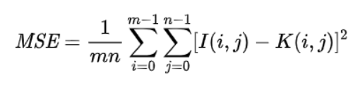

MSE的概念应该是比较熟悉的，这也是常见的损失函数。而PSNR就是通过MSE得出来的，公式如下

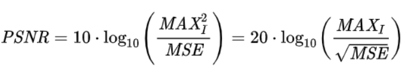

其中，*MAXI*是表示图像点颜色的最大数值，如果每个采样点用 8 位表示，那么就是 255。所以MSE越小，则PSNR越大；所以PSNR越大，代表着图像质量越好。

》PSNR高于40dB说明图像质量极好（即非常接近原始图像），

》在30—40dB通常表示图像质量是好的（即失真可以察觉但可以接受），

》在20—30dB说明图像质量差；

》最后，PSNR低于20dB图像不可接受

### 1.2 SSIM(结构相似性)

SSIM的输入就是两张图像，我们要得到其相似性的两张图像。其中一张是未经压缩的无失真图像(即ground truth)，另一张就是你恢复出的图像。所以，SSIM可以作为super-resolution质量的指标。
假设我们输入的两张图像分别是x和y，那么

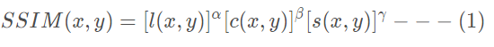

其中

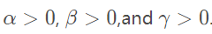

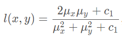

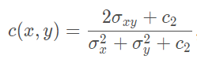

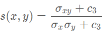

其中l(x, y)是亮度比较，c(x,y)是对比度比较，s(x,y)是结构比较。μ 
x和μy 分别代表x,y的平均值，σx 和σy 分别代表x,y的标准差，*σ**x**y*代表x和y的协方差。c1,c2,c3为常数，避免分母为0。在实际工程计算中，我们一般设定α=β=γ=1 ，以及c3=c2/2 ，将SSIM简化为

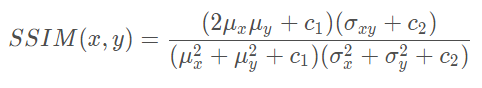

1. SSIM具有对称性，即SSIM(x,y)=SSIM(y,x)
2. SSIM是一个0到1之间的数，越大表示输出图像和无失真图像的差距越小，即图像质量越好。当两幅图像一模一样时，SSIM=1

## 2 WDSR

​	WDSR算法进行剖析。这里的W表示的是wide，即具有更宽泛的特征图。作者对激活函数之前的特征图channel数增多，称为特征图更宽泛。

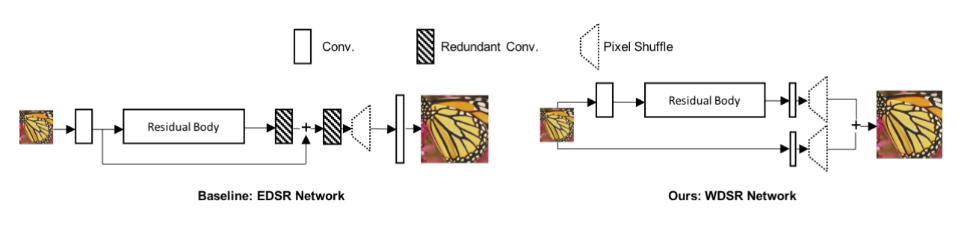

​	WDSR是在EDSR的基础上改进的，EDSR网络结构比较简单， residual body就是一系列的resblock组到一起，可以看作是一个自带激活函数的非线性卷积模块。上图的模块只包含三种：res模块，conv模块和pixel shuffle模块。

### 2.1改造resblock

​	WDSR在EDSR上的结构提升，一方面是去除了很多冗余的卷积层，这样计算更快。另一方面是改造了resblock。

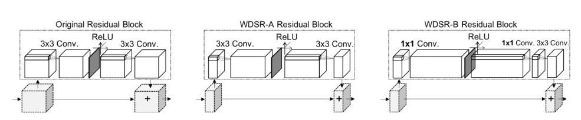

左图是ESDR的原始resblock，中间是WDSR-A，右边的是WDSR-B。作者在文中提出了两个版本的WDSR，这两个版本的区别就是resblock不同而已。 对于EDSR中的resblock，我们成为原始resblock，relu是在两个卷积运算中间，而且卷积核的filter数较少；而WDSR-A是在不增加计算开销的前提下，增加relu前卷积核的filter数以增加feature map的宽度。**作者主要提的trick就是增加激活函数前的特征图的channel数**

### 2.2 Weight Normalization vs Batch Normalization

WN应该算是WDSR的最后一个重要的trick了,将权重进行标准化

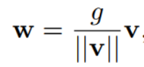

做一个简单的||v||表示v的欧几里得范数，w, v都是K维向量，而g=||w||，是一个标量。w是v的次态。 g/||v||这个标量就是为了线性改变向量v，从而使得||w||更靠近g。这样来使得权重w的值在一个规范的范围内。

### 2.3 pixel shuffle模块

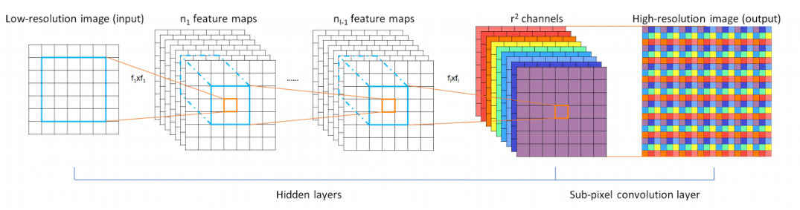

上图很直观得表达了sub-pixel convolution的做法，前面就是一个普通的CNN网络，到后面彩色部分就是sub-pixel conv的操作了。首先，如果我想对原图放大3倍，那么我需要生成出3^2=9个same size的特征图。将九个same size的特征图拼成一个X3的大图，这就是sub-pixel convolution的操作了。

这是一种抽样的反思想，如果把一张x3的大图，每隔三个点抽样一个，那就会得到9张低分辨率的图像。于是，如果我们可以通过CNN来获得9张符合分布的低分辨率图像，那么就可以组成一张高分辨率的大图。

## 3实验结果

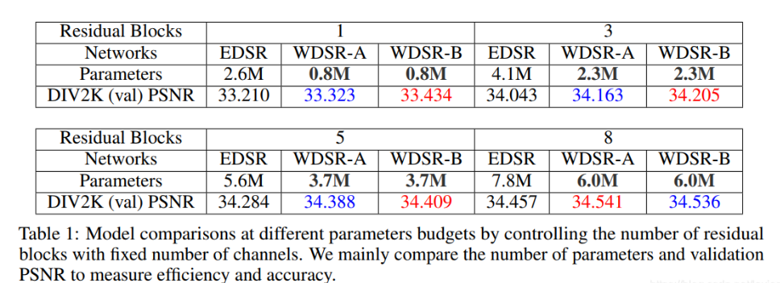

上表数据主要是用PSNR作为指标进行比较，同时，特别讲究参数量，因为参数量直接决定计算开销。上述结果还是有些谦虚的，我用6M参数的WDSR-A测试DIV2K的val PSNR可以达到37多。 就我目前看的所有SR文章来看，对于DIV2K数据集能达到PSNR 35+的算法也就WDSR了。