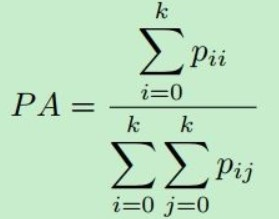
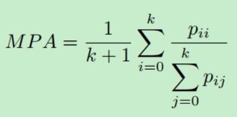
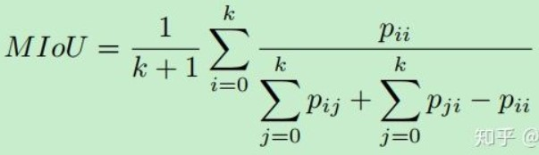

# 语义分割训练

## 1 语义分割评价指标

衡量图像语义分割准确率常用的主要有三种方法：

像素准确率（pixel accuracy, PA）

平均像素准确率（mean pixel accuracy, MPA）

平均IOU（Mean Intersection over Union, MIOU ） 

k ：类别总数，如果包括背景的话就是 k+1 

p{ij} ：真实像素类别为 i 的像素被预测为类别 j 的总数量，换句话说，就是对于类别为 i 的像素来说，被错分成类别 j 的数量有多少。

P{ii} ：真实像素类别为 i 的像素被预测为类别 i 的总数量，换句话说，就是对于真实类别为 i 的像素来说，分对的像素总数有多少。

### 1.1 PA

​	PA的意义很简单，和我们常规的分类准确率计算没有区别，就是把分对的像素总量除以像素总数。

###  1.2 MPA

​	MPA是对PA的改进，它是先对每个类计算PA，然后再对所有类的PA求平均。

### 1.3 MIoU

​	在语义分割中，MIoU才是标准的准确率度量方法。它是分别对每个类计算（真实标签和预测结果的交并比）IOU，然后再对所有类别的IOU求均值。

## 2 Lovász-Softmax

在分割中我们有时会去用intersection over union去衡量模型的表现，但IOU不是一个可导函数，利用IOU直接训练模型会导致训练过程的不稳定。一个模型从坏到好，我们希望监督它的loss/metric的过渡是平滑的，直接暴力套用IoU显然不行，怎么优化IOU一直是语义分割要面临的问题，一般的baseline论文一般通过优化cross entropy去优化IoU。但优化cross entropy并不等同于优化IoU。

有了Lovász-Softmax！A **tractable** **surrogate** for the optimization of the intersection-over-union measure in neural networks

github链接https://github.com/bermanmaxim/LovaszSoftmax