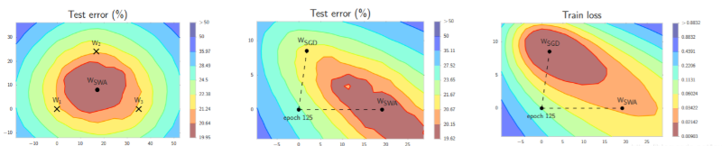
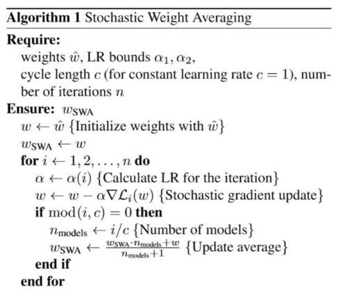

# 语义分割训练

## 1 语义分割评价指标

衡量图像语义分割准确率常用的主要有三种方法：

像素准确率（pixel accuracy, PA）

平均像素准确率（mean pixel accuracy, MPA）

平均IOU（Mean Intersection over Union, MIOU ） 

k ：类别总数，如果包括背景的话就是 k+1 

p{ij} ：真实像素类别为 i 的像素被预测为类别 j 的总数量，换句话说，就是对于类别为 i 的像素来说，被错分成类别 j 的数量有多少。

P{ii} ：真实像素类别为 i 的像素被预测为类别 i 的总数量，换句话说，就是对于真实类别为 i 的像素来说，分对的像素总数有多少。

### 1.1 PA

​	PA的意义很简单，和我们常规的分类准确率计算没有区别，就是把分对的像素总量除以像素总数。

###  1.2 MPA

​	MPA是对PA的改进，它是先对每个类计算PA，然后再对所有类的PA求平均。

### 1.3 MIoU

​	在语义分割中，MIoU才是标准的准确率度量方法。它是分别对每个类计算（真实标签和预测结果的交并比）IOU，然后再对所有类别的IOU求均值。

## 2 Lovász-Softmax

在分割中我们有时会去用intersection over union去衡量模型的表现，但IOU不是一个可导函数，利用IOU直接训练模型会导致训练过程的不稳定。一个模型从坏到好，我们希望监督它的loss/metric的过渡是平滑的，直接暴力套用IoU显然不行，怎么优化IOU一直是语义分割要面临的问题，一般的baseline论文一般通过优化cross entropy去优化IoU。但优化cross entropy并不等同于优化IoU。

有了Lovász-Softmax！A **tractable** **surrogate** for the optimization of the intersection-over-union measure in neural networks

github链接https://github.com/bermanmaxim/LovaszSoftmax

## 3 SWA(随机权重平均)——一种全新的模型优化方法

### 1 简介

随机权重平均(SWA)和随机梯度下降(SGD)有很多相似之处，准确来说SWA是基于SGD的改进版本。典型的深度神经网络训练过程就是用 SGD 来优化一个损失函数，同时使用一个衰减的学习率，直到收敛为止。SWA 论文的结果证明，取 SGD 轨迹的多点简单平均值，以一个周期或者不变的学习率，会比传统训练有更好的泛化效果。论文的结果同样了证明了，随机权重平均 (SWA)相比可以找到更广的最优值域。

SWA的灵感来自于实际观察，每次学习率循环结束时产生的局部最小值趋向于在损失面的边缘区域累积，这些边缘区域上的损失值较小（上面左图中，显示低损失的红色区域上的点W1，W2和W3）。通过对几个这样的点取平均，很有可能得到一个甚至更低损失的、全局化的通用解（上面左图上的Wswa）

### 2 算法流程

就论文中的结果而言，可以看出 SWA相对于 SGD 来说有以下优点：1，不依赖学习率的变化，设置恒定学习率的时候依然可以达到很好的收敛效果。而对于 SGD 而言，恒定学习率会导致收敛情况变差。2，收敛速度十分快，在原测试集上可以在 150 个 epoch 就收敛得非常好，也非常平稳振荡幅度非常小。

### 3 总结

SWA 加入了周期性滑动平均操作来限制权重的变化，解决了传统 SGD 在反向过程中的权重振荡问题。 SGD 是依靠当前 batch 的数据来更新 参数，每一个 epoch 都会调整一次参数，随机挑选的梯度方向极有可能不是最佳梯度方向，甚至与最佳梯度方向有一个很大的夹角，这样大刀阔斧调整的参数， 极其容易振荡。而 SWA限制更新频率，对周期内参数取滑动均值，这样就解决了 SGD 的问题。

pytorch 官方链接https://pytorch.org/blog/stochastic-weight-averaging-in-pytorch/ 

