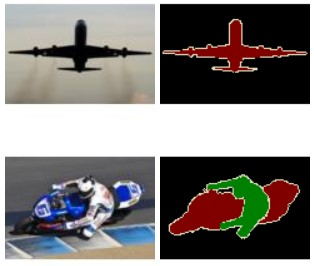
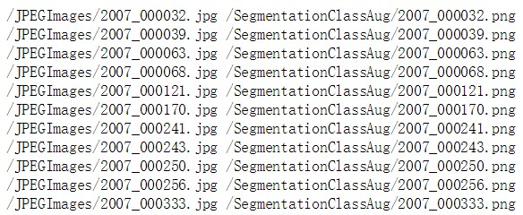
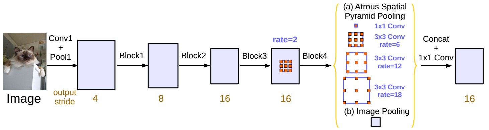
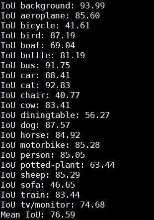
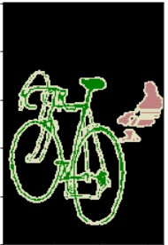
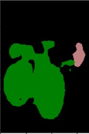
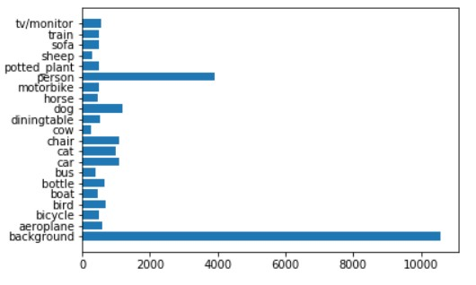

# 语义分割笔记

## 1 语义分割评价指标

衡量图像语义分割准确率常用的主要有三种方法：

像素准确率（pixel accuracy, PA）

平均像素准确率（mean pixel accuracy, MPA）

平均IOU（Mean Intersection over Union, MIOU ） 

k ：类别总数，如果包括背景的话就是 k+1 

p{ij} ：真实像素类别为 i 的像素被预测为类别 j 的总数量，换句话说，就是对于类别为 i 的像素来说，被错分成类别 j 的数量有多少。

P{ii} ：真实像素类别为 i 的像素被预测为类别 i 的总数量，换句话说，就是对于真实类别为 i 的像素来说，分对的像素总数有多少。

### 1.1 PA

​	PA的意义很简单，和我们常规的分类准确率计算没有区别，就是把分对的像素总量除以像素总数。


###  1.2 MPA

​	MPA是对PA的改进，它是先对每个类计算PA，然后再对所有类的PA求平均。


### 1.3 MIoU

​	在语义分割中，MIoU才是标准的准确率度量方法。它是分别对每个类计算（真实标签和预测结果的交并比）IOU，然后再对所有类别的IOU求均值。


## 2 Deeplabv3 训练pascal voc2012数据集

### 2.1数据准备（以pascal voc2012数据集为例）

#### 2.1.1数据介绍

​	pascal voc2012数据集包含20类为物体，算上背景总共有21类。原图像为RGB图像，预测的目标图像模板，尺寸上与原图像一样。对于不同类别的像素点，灰度值为对应的类别序号。对应的类别序号如下，预测时不计255灰度值的像素点。

​	(0=background,1=aeroplane, 2=bicycle, 3=bird, 4=boat, 5=bottle, 6=bus, 7=car , 8=cat, 9=chair, 10=cow, 11=diningtable, 12=dog, 13=horse, 14=motorbike, 15=person, 16=potted plant, 17=sheep, 18=sofa, 19=train, 20=tv/monitor,255为边缘区域)




#### 2.1.2数据加载

​	定义一个txt文件，将输入图像的路径及对应的目标mask图像路径写入，分为两列。



​	以pytorch的数据加载为例。定义一个继承torch.utils.data.Dataset的类，定义初始化函数def __init__，读取写有图像路径的txt文件，形成两个images和masks的list。并利用内置的def __getitem__函数，读取原图像和目标mask文件（数据增强的处理函数也在这里面执行）

```python
class VOCSegmentation(data.Dataset):
  CLASSES = [
      'background', 'aeroplane', 'bicycle', 'bird', 'boat', 'bottle', 'bus',
      'car', 'cat', 'chair', 'cow', 'diningtable', 'dog', 'horse',
      'motorbike', 'person', 'potted-plant', 'sheep', 'sofa', 'train',
      'tv/monitor'
  ]

  def __init__(self, root, train=True, transform=None, target_transform=None, download=False, crop_size=None):
    self.root = root
    _voc_root = os.path.join(self.root, 'VOC2012')
    _list_dir = os.path.join(_voc_root, 'list')
    self.transform = transform
    self.target_transform = target_transform
    self.train = train
    self.crop_size = crop_size

    if download:
      self.download()

    if self.train:
      _list_f = os.path.join(_list_dir, 'train_aug.txt')
    else:
      _list_f = os.path.join(_list_dir, 'val.txt')
    self.images = []
    self.masks = []
    with open(_list_f, 'r') as lines:
      for line in lines:
        _image = _voc_root + line.split()[0]
        _mask = _voc_root + line.split()[1]
        assert os.path.isfile(_image)
        assert os.path.isfile(_mask)
        self.images.append(_image)
        self.masks.append(_mask)

  def __getitem__(self, index):
    _img = Image.open(self.images[index]).convert('RGB')
    _target = Image.open(self.masks[index])

    _img, _target = preprocess(_img, _target,
                               flip=True if self.train else False,
                               scale=(0.5, 2.0) if self.train else None,
                               crop=(self.crop_size, self.crop_size))

    if self.transform is not None:
      _img = self.transform(_img)

    if self.target_transform is not None:
      _target = self.target_transform(_target)

    return _img, _target
```


​	一旦定义好def __getitem__函数，就可以对数据集调用torch.utils.data.DataLoader 类函数，生成对应的数据batch用于训练。

```python
dataset_loader = torch.utils.data.DataLoader(
        dataset, batch_size=args.batch_size, shuffle=args.train,
        pin_memory=True, num_workers=args.workers)
```


### 2.2模型训练

#### 2.2.1模型deeplabv3



其中借鉴的代码中，模型的resnetblock模型并没有用到空洞卷积。

#### 2.2.2训练

+ Loss function: 忽略255灰度标记的交叉熵函数
  nn.CrossEntropyLoss(ignore_index=255)
+ 优化函数：随机梯度下降，optim.SGD。lr=0.007，momentum=0.9, weight_decay=0.0001
+ 样本batch:Bacth=16, epochs =50
+ 评估指标：mIOU

### 2.3实验结果



​	平均IoU为76.59，与论文中的77.21相差不大，在21类中，bicycle、chair、sofa这三个类的IOU低于50。这3类与其它类分割区域不同在于，其他类的分割是占据图像一整块区域，而bicycle、chair、sofa这三类标注的区域块中并不是图像区域的一整块。而训练好Deeplabv3趋向于分割出一整块。这造成了IOU偏低的结果。





### 2.4实验分析



上图为数据增强后，实验用到的数据集类别分布，可以看到mIOU较低的bicycle、chair、sofa的样本数与其它类别相差不大。所以mIOU较低与样本间类平衡关系不大。

#### 2.4.1进一步实验

​	原来网络中，使用交叉熵函数nn.CrossEntropyLoss(ignore_index=255)假定各类之间的权重系数是一样的，针对bicycle、chair、sofa的分割效果不好，对这三类的交叉熵损失的权重系数增大进行实验。